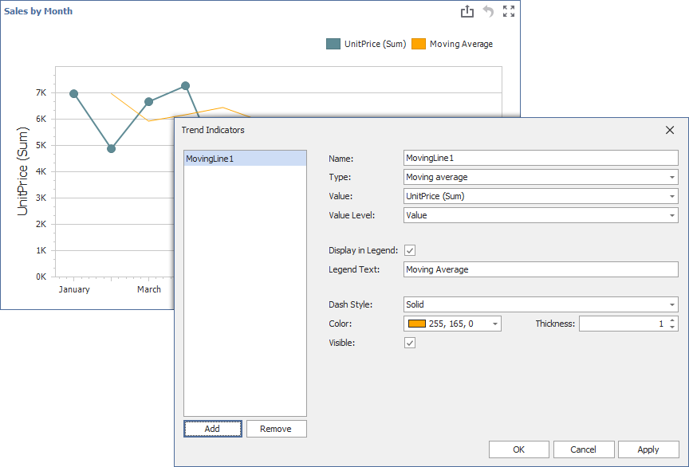

<!-- default badges list -->

<!-- default badges end -->
# BI Dashboard for WinForms - Custom Trend Indicator

The following example creates a custom WinForms “Moving Average” indicator (when using DevExpress BI Dashboard):

1. Create a [ChartCustomIndicator](https://docs.devexpress.com/Dashboard/DevExpress.DashboardCommon.ChartCustomIndicator) descendant (the `MovingIndicator` class in this example). `MovingIndicator` accepts a collection of data points, evaluates values, and returns resulting points. These points are used to draw the indicator.

2. Register `MovingIndicator` in [IndicatorFactory](https://docs.devexpress.com/Dashboard/DevExpress.DashboardCommon.IndicatorFactory) to make it available as an indicator type within the Trend Indicators editor. Call the [Register](https://docs.devexpress.com/Dashboard/DevExpress.DashboardCommon.IndicatorFactory.Register--1(System.String)) method in your application before you save and load a dashboard (to serialize and deserialize the indicator within the dashboard’s XML).

3. Create an instance of `MovingIndicator` and specify desired indicator settings.

4. Add `MovingIndicator` to the chart [indicators collection](https://docs.devexpress.com/Dashboard/DevExpress.DashboardCommon.ChartDashboardItem.Indicators) to display the configured indicator within DevExpress Dashboard’s UI.

## Files to Review

- [Program.cs](./CS/WinformsIndicator/Program.cs) ([Program.vb](./VB/WinformsIndicator/Program.vb))
- [Form1.cs](./CS/WinformsIndicator/FormDesigner.cs) ([Form1.vb](./VB/WinformsIndicator/FormDesigner.vb))

## Documentation

- [Trend Indicators](https://docs.devexpress.com/Dashboard/404406/winforms-dashboard/winforms-designer/create-dashboards-in-the-winforms-designer/dashboard-item-settings/chart/trend-indicators?v=23.1)
